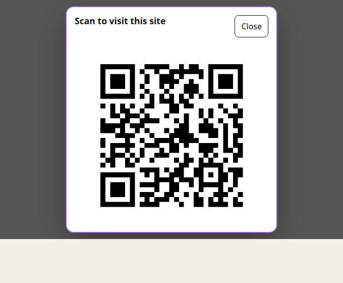

# Share QR

An accessible Digital Garden plugin that generates a deterministic site QR at build time. Visitors can open a responsive dialog, copy the target link, or download SVG or PNG. It makes no network requests, uses no tracking, and never generates QR codes in the browser.



## Install

Install from the Digital Garden community browser after the plugin is listed, or paste this repository URL into the plugin installer. For manual installation, copy this repository into `src/plugins/share-qr/`, enable `share-qr` in `src/plugins/plugins.json`, and restart the development server because the plugin registers an Eleventy hook.

Share QR has no runtime dependencies. It bundles a small MIT-licensed pure-JS QR encoder under `vendor/`, so it works in stock Digital Garden hosts that do not ship the `qrcode` npm package. It does not run install-time scripts or modify the garden.

With a valid `meta.siteBaseUrl`, the plugin works without configuration. Its default `floating.bottomRight` slot renders one ordinary link reading `QR` next to an inline SVG mark, and `common.footer` renders the dialog. Keep `triggerLabel` short: a floating dock has room for a word, not a sentence.

## Settings

The manifest declares typed settings with descriptions, defaults, and environment mappings. Current Digital Garden hosts do not expose a complete generated settings panel, so environment variables are the no-code configuration path. A site owner may also set values in `src/plugins/plugins.json`; registry values take precedence over environment values, then manifest defaults.

| Setting | Default | Rules |
| --- | --- | --- |
| `targetUrl` | site base URL | Absolute HTTP(S), no credentials or embedded whitespace |
| `label` | Scan to visit this site | Escaped plain text, up to 500 characters |
| `filename` | site-qr | Safe 80-character stem; extension added automatically |
| `svg` / `png` | true / true | Select offered formats; both false safely re-enables SVG |
| `triggerLabel` | QR | Escaped plain text, up to 500 characters. Shown as the visible label and prefixed onto the accessible name |
| `triggerIcon` | qr | Built-in inline SVG mark: `qr`, `link`, or `none`. No icon font, raw HTML, or remote asset |
| `maxSize` | 360 | Display pixels clamped to 160-360 |
| `accentToken` | --interactive-accent | CSS custom-property name only |
| `externalTrigger` | false | Suppress the default trigger only when the host supplies one |

Environment names use the `SHARE_QR_` prefix, such as `SHARE_QR_LABEL` and `SHARE_QR_TARGET_URL`.

An invalid explicit URL warns and falls back to validated site metadata. If no valid target remains, the plugin emits no placeholder QR and renders a usable navigation link. SVG and PNG use the same canonical URL, error-correction level M, a four-module quiet zone, black modules on white, and 720 px dimensions, generated deterministically from the vendored encoder.

## Accessibility and progressive enhancement

The default trigger is a real download link without JavaScript. Its mark is an inline SVG drawn by the template and marked `aria-hidden`, so the visible label (default `QR`) is the only text a sighted visitor reads. The accessible name is `triggerLabel`, a colon, then the card label (default `QR: Scan to visit this site`), which keeps the visible text inside the accessible name for voice control while still telling screen-reader users what the control does; the card label is also exposed as the link's `title`. JavaScript enhances the trigger into a dialog with initial focus, Tab containment, Escape and backdrop dismissal, scroll locking, focus restoration, copy success/failure announcements, and 44 px controls. The component deliberately has no motion. QR modules remain black on white in all themes.

If `window.createDialogController(container, options)` exists, Share QR uses that host lifecycle controller. Otherwise it supplies a self-contained accessible fallback.

## Host trigger adapter

Keep `externalTrigger` false unless the host renders exactly one replacement link. The default floating slot intentionally renders no element when this setting is true, so exactly one `[data-share-qr-trigger]` exists on the page either way.

A replacement trigger must use `shareQr`, render `data-share-qr-trigger`, retain a real QR asset `href` plus `download`, and remain visible without JavaScript. A floating tray that owns the corner should set `externalTrigger` to `true` and render its own QR item there: Share QR then contributes nothing to `floating.bottomRight`, and the tray's item inherits the dialog behaviour because the click handler delegates on the attribute, not on the plugin's own element. A tray that claims the slot without setting `externalTrigger` produces two competing corner controls, so the setting is the contract for replacement. The browser adapter is `window.ShareQr.open()` / `.close()`. Before opening, a bubbling `share-qr:before-open` event lets a host collapse navigation and establish a stable opener. Share QR imports no Search, Contact, navigation, or site-specific code.

## Styling

The card and the default trigger follow `.theme-dark` or `[data-theme="dark"]` through one shared token set, so a dark garden never gets a light trigger pill. Optional advanced variables are `--share-qr-surface` and `--share-qr-ink`; `accentToken` selects a host accent variable. None can recolor QR pixels.

## Compatibility, upgrades, and rollback

Tested against Digital Garden 1.90-compatible plugin APIs and Node 22. Plugin releases follow SemVer and tags match `garden-plugin.json`. Patch releases preserve settings and adapter contracts; minor releases may add optional settings; breaking changes require a major version. 1.0.1 is a patch: the default trigger now inherits the card's dark-theme tokens, its mark is an inline SVG glyph instead of the words "QR" and "Link", and the default `triggerLabel` is the short `QR` rather than `Show site QR`.

To roll back, pin an earlier release in the installer. To remove Share QR, disable it in `src/plugins/plugins.json`, remove `src/plugins/share-qr/`, and restart the development server. No notes or external data need migration.

## Development

```sh
npm ci
npm test
```

Tests cover manifest paths and generic identity, URL and filename safety, deterministic output, PNG decoding, failure fallbacks, template escaping, dialog lifecycle, copy behavior, reduced motion, and 320/390/600/1200 px geometry in light and dark themes. Host-specific dogfood tests remain in the host garden rather than this repository.

## Privacy and provenance

Share QR generates local build assets from the configured URL. It performs no runtime network calls and stores nothing. Extracted and redesigned from Paolo Gabriel's Digital Garden integration. The optional shared dialog controller is a host API and is not bundled. The bundled QR encoder is `qrcode-generator` by Kazuhiko Arase, MIT-licensed; see `vendor/LICENSE.qrcode-generator`.
